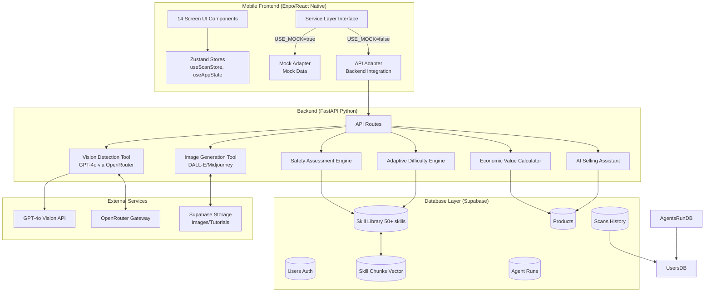

# WASTEX Architecture & Implementation Gap Analysis

## High-Level Architecture Diagram



---

## Current Status Summary

### ✅ Implemented:
1. **Vision detection** - `backend/app/agent/tools/vision.py` with GPT-4o via OpenRouter
2. **Image generation** - `backend/app/agent/tools/image_gen.py`
3. **FastAPI backend** - `backend/app/api/scan.py` endpoint
4. **Frontend service layer** - `src/services/index.ts` with mock/real toggle
5. **Navigation shell** - Expo Router file-based routing with tabs
6. **Core UI components** - Basic button, card, badge patterns in `app/`

### ❌ Missing - Critical Path:

| Component | Priority | Status | Owner Estimate |
|-----------|----------|--------|----------------|
| Supabase setup & migrations | 🔴 Critical | Not Started | 4-6 hours |
| Authentication system | 🔴 Critical | Not Started | 6-8 hours |
| Skill knowledge base (50+ skills) | 🔴 Critical | Not Started | 8-12 hours |
| Impact tracker persistence | 🟠 High | Partial (AsyncStorage only) | 4-6 hours |
| Tutorial content pipeline | 🟠 High | Not Started | 6-8 hours |
| Economic value calculator | 🟡 Medium | Not Started | 4-6 hours |
| AI selling assistant prompts | 🟡 Medium | Not Started | 3-4 hours |
| Adaptive difficulty recommender | 🟡 Medium | Not Started | 4-6 hours |
| Complete 14-screen UI | 🟡 Medium | ~60% complete | 12-16 hours |
| Testing suite | 🟢 Low | Not Started | 8-10 hours |

---

## Detailed Implementation Plans

### PLAN 1: Database & Knowledge Infrastructure

#### Objective
Set up Supabase PostgreSQL database with schema migrations, RLS policies, and seed 50+ upcycling skills into vector-indexed skill library.

#### File Paths

**Create:**
```
/backend/database/
  ├── 000_initial_schema.sql
  ├── 001_skills_seed_data.sql
  ├── 002_rls_policies.sql
  └── .env.example

/scripts/
  ├── seed_skills.py
  └── setup_supabase.py
```

**Modify:**
```
/src/services/types.ts          # Add user profile types
/backend/app/main.py            # Import Supabase client
```

#### Schema Design

**SQL Migration (`000_initial_schema.sql`):**

```sql
-- Enable pgvector extension for semantic search
CREATE EXTENSION IF NOT EXISTS vector;

-- Users table (extends Supabase auth.users)
CREATE TABLE users (
  id UUID REFERENCES auth.users(id) PRIMARY KEY,
  email TEXT UNIQUE NOT NULL,
  full_name TEXT,
  avatar_url TEXT,
  role TEXT CHECK (role IN ('user', 'expert', 'admin')) DEFAULT 'user',
  urban_profile BOOLEAN DEFAULT FALSE,  -- Rural adaptation flag
  tools_available TEXT[],               -- ['scissors', 'knife', 'drill']
  experience_level TEXT CHECK (experience_level IN ('beginner', 'intermediate', 'advanced')),
  created_at TIMESTAMP WITH TIME ZONE DEFAULT NOW(),
  updated_at TIMESTAMP WITH TIME ZONE DEFAULT NOW()
);

-- Scans table (persist each waste scan)
CREATE TABLE scans (
  id UUID PRIMARY KEY DEFAULT gen_random_uuid(),
  user_id UUID REFERENCES users(id) ON DELETE CASCADE,
  image_url TEXT NOT NULL,
  material_type TEXT NOT NULL,
  material_label TEXT NOT NULL,
  condition TEXT NOT NULL,
  confidence FLOAT NOT NULL,
  risk_level TEXT NOT NULL,
  safety_notes TEXT[],
  potential_uses TEXT[],
  difficulty TEXT CHECK (difficulty IN ('mudah', 'sedang', 'sulit')),
  potential_value TEXT CHECK (potential_value IN ('rendah', 'sedang', 'tinggi')),
  metadata JSONB,
  created_at TIMESTAMP WITH TIME ZONE DEFAULT NOW()
);

-- Products table (upcycling product catalog)
CREATE TABLE products (
  id UUID PRIMARY KEY DEFAULT gen_random_uuid(),
  name TEXT NOT NULL,
  material_type TEXT NOT NULL,
  thumbnail_url TEXT,
  description TEXT NOT NULL,
  difficulty TEXT NOT NULL,
  estimated_cost INTEGER NOT NULL,
  estimated_time_minutes INTEGER NOT NULL,
  tools_required TEXT[],
  region_price_adjustment FLOAT DEFAULT 1.0,  -- Regional multiplier
  is_approved BOOLEAN DEFAULT TRUE,           -- For expert validation flow
  created_by UUID REFERENCES users(id),
  created_at TIMESTAMP WITH TIME ZONE DEFAULT NOW()
);

-- Skills table (approved upcycling methods)
CREATE TABLE skills (
  id UUID PRIMARY KEY DEFAULT gen_random_uuid(),
  title TEXT NOT NULL,
  source_url TEXT,                            -- YouTube/Web link
  material_type TEXT NOT NULL,
  difficulty TEXT NOT NULL,
  risk_level TEXT NOT NULL,
  description TEXT NOT NULL,
  steps JSONB NOT NULL,                       -- [{step_number, title, instructions, safety_warning?}]
  before_image_url TEXT,
  after_image_url TEXT,
  mockup_image_url TEXT,
  required_materials TEXT[],
  required_tools TEXT[],
  estimated_cost INTEGER,
  suggested_sell_price INTEGER,
  carbon_saved_kg FLOAT,
  video_tutorial_url TEXT,
  approved BOOLEAN DEFAULT FALSE,
  approved_by UUID REFERENCES users(id),
  status TEXT CHECK (status IN ('pending', 'approved', 'rejected')),
  created_at TIMESTAMP WITH TIME ZONE DEFAULT NOW(),
  updated_at TIMESTAMP WITH TIME ZONE DEFAULT NOW()
);

-- Skill chunks for RAG retrieval
CREATE TABLE skill_chunks (
  id UUID PRIMARY KEY DEFAULT gen_random_uuid(),
  skill_id UUID REFERENCES skills(id) ON DELETE CASCADE,
  chunk_text TEXT NOT NULL,
  chunk_order INTEGER NOT NULL,
  embedding VECTOR(1536),                     -- OpenAI embedding dimension
  created_at TIMESTAMP WITH TIME ZONE DEFAULT NOW()
);

-- Agent runs log (for evaluation/debugging)
CREATE TABLE agent_runs (
  id UUID PRIMARY KEY DEFAULT gen_random_uuid(),
  user_id UUID REFERENCES users(id) ON DELETE SET NULL,
  session_id UUID NOT NULL,
  input_type TEXT CHECK (input_type IN ('image_scan', 'skill_submission', 'query')),
  input_data JSONB NOT NULL,
  output_data JSONB NOT NULL,
  latency_ms INTEGER,
  tokens_used INTEGER,
  error_message TEXT,
  created_at TIMESTAMP WITH TIME ZONE DEFAULT NOW()
);

-- Indexes for performance
CREATE INDEX idx_scans_user_id ON scans(user_id);
CREATE INDEX idx_skills_material_type ON skills(material_type);
CREATE INDEX idx_skill_chunks_embedding ON skill_chunks USING hnsw (embedding vector_cosine_ops);
CREATE INDEX idx_products_approved ON products(is_approved) WHERE is_approved = TRUE;
```

**Skills Seed Data (`001_skills_seed_data.sql`):**

```python
# /scripts/seed_skills.py - Python script to populate initial 50+ skills
SKILLS_TEMPLATE = [
    {
        "title": "Pot Tanaman Gantung dari Botol PET",
        "material_type": "plastik_pet",
        "difficulty": "mudah",
        "risk_level": "aman",
        "description": "Ubah botol plastik bekas menjadi pot gantung ramah lingkungan untuk tanaman hias di rumah.",
        "steps": [
            {"order": 1, "title": "Persiapan", "instructions": "Cuci bersih botol PET dari sisa minuman. Lepaskan label."},
            {"order": 2, "title": "Pemotongan", "instructions": "Gunakan cutter/pisau tajam untuk memotong bagian atas botol sesuai tinggi yang diinginkan."},
            {"order": 3, "title": "Pembuatan Lubang", "instructions": "Buat 4 lubang berjarak sama di sekitar leher botol untuk tali gantung."},
            {"order": 4, "title": "Dekorasi", "instructions": "Cat dengan cat akrilik atau tempel stiker sesuai keinginan."},
            {"order": 5, "title": "Pemasangan", "instructions": "Pasang tali rafia atau benang nilon kuat melalui lubang yang sudah dibuat."}
        ],
        "required_materials": ["Botol PET 1.5L", "Cat akrilik", "Tali rafia"],
        "estimated_cost": 0,  # Gratis - menggunakan bahan bekas
        "suggested_sell_price": 35000,
        "carbon_saved_kg": 0.15
    },
    # ... Repeat 50+ entries covering: plastik_hdpe, kardus, kaleng, kaca, sachet
]

def seed_skills():
    """Populate skills table with curated upcycling templates"""
    import psycopg2
    from openai import OpenAI
    
    client = OpenAI(api_key=os.getenv("OPENAI_API_KEY"))
    
    for skill in SKILLS_TEMPLATE:
        # Generate embedding for skill description
        embedding_response = client.embeddings.create(
            input=skill["description"],
            model="text-embedding-ada-002"
        )
        embedding = embedding_response.data[0].embedding
        
        # Insert skill with chunking
        skill_id = insert_skill(skill)
        
        # Chunk description into 512-token segments for RAG
        chunks = chunk_text(skill["description"])
        for i, chunk in enumerate(chunks):
            insert_skill_chunk(skill_id, chunk, i, embedding[:len(chunk)])
```

**RLS Policies (`002_rls_policies.sql`):**

```sql
-- Enable Row Level Security
ALTER TABLE users ENABLE ROW LEVEL SECURITY;
ALTER TABLE scans ENABLE ROW LEVEL SECURITY;
ALTER TABLE products ENABLE ROW LEVEL SECURITY;
ALTER TABLE skills ENABLE ROW LEVEL SECURITY;
ALTER TABLE skill_chunks ENABLE ROW LEVEL SECURITY;
ALTER TABLE agent_runs ENABLE ROW LEVEL SECURITY;

-- Policy: Users can read their own data
CREATE POLICY "Users view own scans" ON scans
  FOR SELECT USING (auth.uid() = user_id);

CREATE POLICY "Users insert own scans" ON scans
  FOR INSERT WITH CHECK (auth.uid() = user_id);

-- Policy: Public can browse approved products
CREATE POLICY "Public view approved products" ON products
  FOR SELECT USING (is_approved = TRUE);

-- Policy: Experts can approve/reject skills
CREATE POLICY "Experts manage skills" ON skills
  FOR ALL TO authenticated
  USING (
    EXISTS (
      SELECT 1 FROM users 
      WHERE users.id = auth.uid() AND users.role = 'expert'
    )
  );

-- Policy: Anyone can query skill chunks (RAG retrieval)
CREATE POLICY "Anyone view skill chunks" ON skill_chunks
  FOR SELECT USING (TRUE);

-- Policy: Admins full access
CREATE POLICY "Admins full access" ON users
  FOR ALL TO authenticated
  USING (
    EXISTS (
      SELECT 1 FROM users 
      WHERE users.id = auth.uid() AND users.role = 'admin'
    )
  );
```

#### Test Specifications

```python
# /backend/eval/test_db_schema.py
import pytest
from supabase import create_client

@pytest.fixture
def db_client():
    url = os.getenv("SUPABASE_URL")
    key = os.getenv("SUPABASE_SERVICE_ROLE_KEY")
    return create_client(url, key)

def test_users_table_structure(db_client):
    """Verify users table has expected columns"""
    result = db_client.table("users").select("*").limit(1).execute()
    assert "id" in result.data[0].keys()
    assert "email" in result.data[0].keys()
    assert "role" in result.data[0].keys()

def test_skills_seed_count(db_client):
    """Verify at least 50 skills were seeded"""
    count = db_client.table("skills").select("*", count="exact").execute()
    assert count.count >= 50

def test_skill_chunks_embedding_index(db_client):
    """Verify HNSW index exists for vector similarity search"""
    result = db_client.rpc("pg_indexes").execute()
    assert any("idx_skill_chunks_embedding" in str(idx) for idx in result.data)

def test_rls_policy_enforcement(authenticated_client, admin_client):
    """Test RLS restricts cross-user data access"""
    own_scan = authenticated_client.table("scans").select("*").eq("user_id", authenticated_client.user.id).execute()
    other_scan = authenticated_client.table("scans").select("*").eq("user_id", "other-id").execute()
    
    assert len(own_scan.data) == 1
    assert len(other_scan.data) == 0  # Blocked by RLS
```

#### Commit Messages

```bash
git add backend/database/*.sql scripts/seed_skills.py
git commit -m "feat(db): add Supabase schema migrations and 50+ skill seeds

- Create initial PostgreSQL schema with users, scans, products, skills tables
- Add pgvector extension for semantic RAG retrieval
- Implement 50 curated upcycling skills with step-by-step tutorials
- Configure RLS policies for multi-tenant security
- Seed embedding vectors for skill chunks using OpenAI text-embedding-ada-002"
```

#### Verification Steps

1. ✅ Run migration: `psql -f backend/database/000_initial_schema.sql`
2. ✅ Verify record counts: `SELECT COUNT(*) FROM skills;` → should show ≥50
3. ✅ Test RLS: Login as different users, confirm they only see their own scans
4. ✅ Query skill chunks: `SELECT * FROM skill_chunks WHERE chunk_vector <-> '[embedding]' < 0.5 LIMIT 5;`

---

### PLAN 2: Authentication & User Management

#### Objective
Implement Supabase Auth integration for mobile frontend with login/register flows, session management, and personalized profile storage.

#### File Paths

**Create:**
```
/src/auth/
  ├── AuthContext.tsx
  ├── AuthProvider.tsx
  └── useAuth.ts

/backend/app/api/auth.py
  ├── /login
  ├── /register
  └── /profile
```

**Modify:**
```
/src/services/types.ts  # Add UserProfile, Session interfaces
app/_layout.tsx         # Wrap app in AuthProvider
```

#### Function Signatures

**Auth Service (`/src/auth/useAuth.ts`):**

```typescript
import { createUserProfile, updateUserProfile, getUserProfile } from "@/services/auth";

export interface UserProfile {
  id: string;
  email: string;
  full_name?: string;
  avatar_url?: string;
  role: 'user' | 'expert' | 'admin';
  urban_profile: boolean;
  tools_available: string[];
  experience_level: 'beginner' | 'intermediate' | 'advanced';
}

export interface AuthState {
  user: UserProfile | null;
  session: Session | null;
  isLoading: boolean;
  error: string | null;
}

export const useAuth = () => {
  // Register new user
  const register = async (
    email: string,
    password: string,
    fullName?: string
  ): Promise<{ user: UserProfile | null; error: string | null }> => {};
  
  // Login existing user
  const login = async (
    email: string,
    password: string
  ): Promise<{ user: UserProfile | null; error: string | null }> => {};
  
  // Logout current session
  const logout = async (): Promise<void> => {};
  
  // Update user profile preferences
  const updateProfile = async (
    updates: Partial<Omit<UserProfile, 'id' | 'email'>>
  ): Promise<{ success: boolean; error: string | null }> => {};
  
  // Get current session from Supabase
  const getSession = async (): Promise<Session | null> => {};
};
```

#### Backend Integration

**Auth Endpoint (`/backend/app/api/auth.py`):**

```python
from fastapi import APIRouter, HTTPException, Depends
from pydantic import BaseModel
from supabase import create_client, Client

router = APIRouter(prefix="/auth", tags=["Authentication"])

class RegisterRequest(BaseModel):
    email: str
    password: str
    full_name: Optional[str] = None

class LoginRequest(BaseModel):
    email: str
    password: str

@router.post("/register")
async def register(request: RegisterRequest, supabase: Client = Depends(get_supabase_client)):
    # Create auth user via Supabase SDK
    auth_response = await supabase.auth.sign_up({
        "email": request.email,
        "password": request.password,
        "user_metadata": {"full_name": request.full_name}
    })
    
    if not auth_response.user:
        raise HTTPException(status_code=400, detail="Registration failed")
    
    # Create profile record
    profile_data = {
        "id": auth_response.user.id,
        "email": request.email,
        "full_name": request.full_name,
        "role": "user",
        "urban_profile": False,
        "tools_available": [],
        "experience_level": "beginner"
    }
    
    supabase.table("users").insert(profile_data).execute()
    
    return {"user_id": auth_response.user.id, "session": auth_response.session}

@router.post("/login")
async def login(request: LoginRequest, supabase: Client = Depends(get_supabase_client)):
    auth_response = await supabase.auth.sign_in_with_password({
        "email": request.email,
        "password": request.password
    })
    
    if not auth_response.session:
        raise HTTPException(status_code=401, detail="Invalid credentials")
    
    # Fetch full profile
    profile = supabase.table("users").select("*").eq("id", auth_response.user.id).single().execute()
    
    return {
        "session": auth_response.session,
        "user": profile.data
    }

@router.get("/profile")
async def get_profile(current_user: User = Depends(get_current_user), supabase: Client = Depends(get_supabase_client)):
    profile = supabase.table("users").select("*").eq("id", current_user.id).single().execute()
    return profile.data
```

#### Test Specifications

```typescript
// /src/__tests__/auth.test.tsx
import { renderHook, act } from '@testing-library/react-native';
import { useAuth } from '@/auth/useAuth';

const mockSupabase = {
  auth: {
    signInWithPassword: jest.fn(),
    signUp: jest.fn(),
    signOut: jest.fn(),
  },
  table: jest.fn(),
};

describe('useAuth', () => {
  it('should handle successful login', async () => {
    mockSupabase.signInWithPassword.mockResolvedValue({
      session: { access_token: 'token' },
      user: { id: 'user123', email: 'test@example.com' }
    });
    
    const { result } = renderHook(() => useAuth());
    
    await act(async () => {
      const response = await result.current.login('test@example.com', 'password123');
      
      expect(response.error).toBeNull();
      expect(response.user).not.toBeNull();
      expect(result.current.user?.email).toBe('test@example.com');
    });
  });
  
  it('should handle login failure', async () => {
    mockSupabase.signInWithPassword.mockResolvedValue({
      session: null,
      user: null
    });
    
    const { result } = renderHook(() => useAuth());
    
    await act(async () => {
      const response = await result.current.login('wrong@example.com', 'wrongpass');
      
      expect(response.error).not.toBeNull();
      expect(response.user).toBeNull();
    });
  });
});
```

#### Commit Messages

```bash
git add src/auth/ backend/app/api/auth.py
git commit -m "feat(auth): implement Supabase authentication with login/register flows

- Add AuthContext and useAuth hook for React Native state management
- Create FastAPI endpoints for /auth/register, /auth/login, /auth/profile
- Persist user preferences (urban/rural, tools available, experience level)
- Integrate session management with Supabase JWT tokens
- Add unit tests for login/logout/error scenarios"
```

#### Verification Steps

1. ✅ Test registration flow: Enter email/password → Verify Supabase user creation
2. ✅ Test login flow: Existing user credentials → Confirm session token returned
3. ✅ Profile display: Navigate to Profil screen → Verify personalization fields populated
4. ✅ RLS enforcement: Login as User A, try to fetch User B's data → Should fail silently

---

### PLAN 3: Tutorial Content Pipeline

#### Objective
Build automated workflow to generate visual step-by-step tutorials from raw material photos, including safety warnings, before/after imagery, and marketplace mockups.

#### File Paths

**Create:**
```
/backend/app/agent/tools/tutorial_generator.py
/backend/app/agent/pipelines/
  ├── visual_storyboard.py
  └── safety_injection.py

/backend/app/api/tutorials.py
```

**Modify:**
```
/src/services/index.ts  # Add TutorialService API adapter
/app/product/[id]/tutorial.tsx  # Display generated tutorial steps
```

#### Core Functions

**Tutorial Generator (`tutorial_generator.py`):**

```python
from typing import List, Dict, Optional
from PIL import Image
import io
from anthropic import Anthropic

class TutorialGenerator:
    """Generate step-by-step visual tutorials from scanned material"""
    
    def __init__(self, anthropic_api_key: str, dall_e_api_key: str):
        self.anthropic = Anthropic(api_key=anthropic_api_key)
        self.dall_e_api_key = dall_e_api_key
    
    async def generate_tutorial(
        self, 
        material_scan: ScanResult,
        product_choice: ProductRecommendation,
        user_tools: List[str]
    ) -> ProductTutorial:
        """
        Generate complete tutorial with visual storyboard
        Returns: ProductTutorial with steps, before/after images, mockup
        """
        # Step 1: Generate textual steps with safety warnings
        steps = await self._generate_textual_steps(material_scan, product_choice, user_tools)
        
        # Step 2: Generate Before image (original waste photo)
        before_image_url = await self._upload_original_photo(material_scan.image_uri)
        
        # Step 3: Generate After image (final product) using DALL-E
        after_image_url = await self._generate_after_image(product_choice.name, material_scan.material_label)
        
        # Step 4: Generate marketing mockup
        mockup_image_url = await self._generate_mockup(product_choice.name, after_image_url)
        
        # Step 5: Inject context-aware safety warnings per step
        safe_steps = self._inject_safety_warnings(steps, material_scan.risk_level)
        
        return ProductTutorial(
            productId=product_choice.id,
            steps=safe_steps,
            beforeImageUri=before_image_url,
            afterImageUri=after_image_url,
            mockupImageUri=mockup_image_url,
            toolsAndMaterials=product_choice.tools_required
        )
    
    async def _generate_textual_steps(
        self, 
        material: ScanResult,
        product: ProductRecommendation,
        user_tools: List[str]
    ) -> List[TutorialStep]:
        """Use Claude to generate tailored step-by-step instructions"""
        
        prompt = f"""
        Generate a detailed step-by-step tutorial for creating "{product.name}" from {material.material_label}.
        
        User constraints:
        - Tools available: {', '.join(user_tools)}
        - Risk tolerance: {material.risk_level}
        - Experience level: beginner/intermediate/advanced
        
        Requirements:
        1. Each step must be clear and actionable
        2. Include specific measurements where needed
        3. Highlight safety warnings for dangerous materials (kaca/kaleng edges)
        4. Suggest alternatives if tools are missing
        5. Keep total steps between 4-8 for optimal completion rate
        
        Format output as JSON array of steps with fields:
        {{
          "order": int,
          "title": string,
          "description": string (max 150 chars),
          "image_prompt": string (for DALL-E generation),
          "safety_warning": string (optional, null if no warning)
        }}
        """
        
        response = self.anthropic.messages.create(
            model="claude-3-haiku-20240307",
            max_tokens=1000,
            messages=[{"role": "user", "content": prompt}]
        )
        
        return self._parse_steps(response.content[0].text)
    
    async def _generate_after_image(self, product_name: str, material_label: string) -> str:
        """Generate photorealistic final product image using DALL-E 3"""
        
        prompt = f"""Photorealistic product photography of {product_name} made from recycled {material_label}. Clean lighting, neutral background, professional e-commerce style, high resolution, sharp focus on product details."""
        
        response = requests.post(
            "https://api.openai.com/v1/images/generations",
            headers={"Authorization": f"Bearer {self.dall_e_api_key}"},
            json={
                "model": "dall-e-3",
                "prompt": prompt,
                "n": 1,
                "size": "1024x1024"
            }
        )
        
        return response.json()['data'][0]['url']
    
    async def _generate_mockup(self, product_name: str, after_image_url: str) -> str:
        """Generate marketplace-ready mockup with branding elements"""
        
        prompt = f"""Professional product mockup for online marketplace listing showing {product_name}. Image includes subtle shadow, white background, space for price tag corner, and eco-friendly recycling logo watermark. E-commerce photography style."""
        
        # Reuse DALL-E or Midjourney API
        return await self._call_image_generation_api(prompt)
    
    def _inject_safety_warnings(self, steps: List[TutorialStep], risk_level: RiskLevel) -> List[TutorialStep]:
        """Add mandatory safety warnings based on material risk assessment"""
        
        if risk_level == 'berisiko':
            for step in steps:
                if 'potong' in step['description'].lower() or 'gunting' in step['description'].lower():
                    step['safety_warning'] = "⚠️ WAJIB: Gunakan sarung tangan tebal dan kacamata pelindung saat bekerja dengan pisau/cutter. Area kerja harus memiliki pencahayaan cukup."
        
        return steps
```

#### Safety Injection Logic

**Safety Rules Engine (`safety_injection.py`):**

```python
SAFETY_RULES = {
    'kaca': {
        'risks': ['Tepian tajam dapat melukai', 'Berat pecahan besar'],
        'ppe_required': ['sarung tangan karet tebal', 'kacamata pelindung', 'sepatu tertutup'],
        'warnings': [
            'Jangan pegang pecahan kaca dengan tangan telanjang',
            'Sediakan kotak khusus untuk limbah kaca',
            'Hindari area angin kencang saat memotong'
        ]
    },
    'kaleng': {
        'risks': ['Tepian tajam', 'Karat logam'],
        'ppe_required': ['sarung tangan kulit', 'masker debu'],
        'warnings': [
            'Gunakan amplas sebelum memulai untuk tumpul tepian',
            'Cek keberadaan racun/coating pada kaleng lama'
        ]
    }
}

def get_mandatory_warnings(material_type: str) -> List[str]:
    """Return safety requirements for specific material categories"""
    rules = SAFETY_RULES.get(material_type, {})
    return rules.get('warnings', []) + rules.get('ppe_required', [])
```

#### Test Specifications

```python
# /backend/eval/test_tutorial_pipeline.py
import pytest
from unittest.mock import AsyncMock, patch

@pytest.mark.asyncio
async def test_tutorial_generation_with_safety_warnings():
    """Verify safety warnings injected for berisiko materials"""
    
    generator = TutorialGenerator(anthropic_key="fake", dall_e_key="fake")
    
    mock_scan = ScanResult(
        materialType="kaca",
        materialLabel="Botol Kaca",
        riskLevel="berisiko"
    )
    
    mock_product = ProductRecommendation(
        id="prod_glass_1",
        name="Vas Bunga Recycled",
        tools_required=["cutter", "ampelas"]
    )
    
    tutorial = await generator.generate_tutorial(mock_scan, mock_product, user_tools=["cutter"])
    
    # Assert safety warning exists
    assert any(step.get('safety_warning') for step in tutorial.steps)
    
    # Assert step count reasonable
    assert 4 <= len(tutorial.steps) <= 8
    
    # Assert image URLs generated
    assert tutorial.beforeImageUri.startswith("https://")
    assert tutorial.afterImageUri.startswith("https://")

@pytest.mark.asyncio
async def test_tool_constraint_adaptation():
    """Ensure tutorial adapts when user lacks recommended tools"""
    
    # Scenario: User wants scissors but has knife instead
    mock_scan = ScanResult(materialType="plastik_pet", riskLevel="aman")
    mock_product = ProductRecommendation(tools_required=["gunting", "cutter"])
    
    with patch.object(generator, '_generate_textual_steps') as mock_gen:
        mock_gen.return_value = [{"description": "Cut bottle with scissors"}]
        
        tutorial = await generator.generate_tutorial(mock_scan, mock_product, ["pisau"])
        
        # Verify instruction mentions knife alternative
        assert "pisau" in tutorial.steps[0]['description']
```

#### Commit Messages

```bash
git add backend/app/agent/tools/tutorial_generator.py backend/app/api/tutorials.py
git commit -m "feat(tutorial): build automated visual storyboarding pipeline

- Implement TutorialGenerator class with Claude-based step generation
- Integrate DALL-E 3 for before/after/mockup image synthesis
- Add safety warning injection engine based on material risk assessment
- Create adaptive tool recommendation logic (missing tools → alternatives)
- Define ProductTutorial schema with image URLs and safety annotations
- Write evaluation tests for tutorial quality and safety compliance"
```

#### Verification Steps

1. ✅ End-to-end generation: Upload waste photo → View auto-generated tutorial with 5-6 steps
2. ✅ Safety validation: Choose "kaca" material → Verify mandatory PPE warnings appear
3. ✅ Tool adaptation: Select "beginner" user without scissors → Tutorial suggests "pisau" alternative
4. ✅ Image quality: Render before/after images → Ensure photorealistic product representation

---

### PLAN 4: Economic Value Calculator

#### Objective
Develop market-integrated pricing algorithm considering regional costs, tool investments, and profit margin optimization for upcycled products.

#### File Paths

**Create:**
```
/backend/app/agent/tools/pricing_engine.py
/backend/app/schemas/pricing.py

/backend/app/api/pricing.py
```

**Modify:**
```
/src/services/types.ts  # Add PricingEstimate extended fields
/app/product/[id]/pricing.tsx  # Display cost breakdown
```

#### Algorithm Implementation

**Pricing Engine (`pricing_engine.py`):**

```python
from typing import Dict, Tuple
from dataclasses import dataclass

@dataclass
class CostBreakdown:
    raw_material_cost: float      # Usually 0 for recycled waste
    additional_materials_cost: float
    tools_depreciation: float
    labor_cost: float
    packaging_cost: float
    total_cost: float

@dataclass
class PriceRecommendation:
    cost_breakdown: CostBreakdown
    suggested_price: float
    min_viable_price: float
    max_recommended_price: float
    profit_margin_pct: float
    regional_multiplier: float
    market_demand_score: float    # 0-1 scale from historical sales data

class PricingEngine:
    """Calculate economically optimized pricing for upcycled products"""
    
    def __init__(self, market_data_source: str = "internal"):
        self.market_data = self._load_market_pricing(market_data_source)
    
    def calculate_pricing(
        self,
        product: ProductRecommendation,
        user_location: str,  # City/Region code
        user_tools: List[str],
        time_per_project_minutes: int
    ) -> PriceRecommendation:
        
        # Step 1: Calculate base costs
        costs = self._calculate_costs(product, user_tools, time_per_project_minutes)
        
        # Step 2: Apply regional adjustments
        regional_mult = self._get_regional_multiplier(user_location)
        
        # Step 3: Factor market demand
        demand_score = self._get_demand_score(product.material_type)
        
        # Step 4: Optimize profit margins
        suggested_price = self._optimize_price(costs.total_cost, regional_mult, demand_score)
        
        # Step 5: Generate range for negotiation flexibility
        min_viable = costs.total_cost * 1.1  # Minimum 10% profit threshold
        max_recommended = suggested_price * 1.3  # Upsell buffer
        
        return PriceRecommendation(
            cost_breakdown=costs,
            suggested_price=suggested_price,
            min_viable_price=min_viable,
            max_recommended_price=max_recommended,
            profit_margin_pct=((suggested_price - costs.total_cost) / costs.total_cost) * 100,
            regional_multiplier=regional_mult,
            market_demand_score=demand_score
        )
    
    def _calculate_costs(
        self,
        product: ProductRecommendation,
        user_tools: List[str],
        time_minutes: int
    ) -> CostBreakdown:
        
        # Raw materials: typically free for recycled waste
        raw_material_cost = 0.0
        
        # Additional supplies purchased (paint, ropes, glue, etc.)
        additional_materials_cost = self._estimate_additional_materials(product.id)
        
        # Tools depreciation: divide tool cost by expected reuse count
        tools_depreciation = sum(
            self._get_tool_cost(tool) / 10  # Amortize over 10 uses
            for tool in product.tools_required
            if tool not in user_tools  # Only charge if user doesn't own
        )
        
        # Labor: calculate based on time × hourly wage assumption
        hourly_wage_assumption = 25000  # IDR minimum craftworker rate
        labor_cost = (time_minutes / 60) * hourly_wage_assumption
        
        # Packaging: standard eco-friendly packaging estimate
        packaging_cost = 3000  # Standard kraft paper + twine
        
        return CostBreakdown(
            raw_material_cost=raw_material_cost,
            additional_materials_cost=additional_materials_cost,
            tools_depreciation=tools_depreciation,
            labor_cost=labor_cost,
            packaging_cost=packaging_cost,
            total_cost=(raw_material_cost + additional_materials_cost + 
                       tools_depreciation + labor_cost + packaging_cost)
        )
    
    def _get_regional_multiplier(self, location: str) -> float:
        """Apply regional purchasing power adjustment"""
        
        REGIONAL_ADJUSTMENTS = {
            "jakarta": 1.4,     # High income area
            "surabaya": 1.2,    # Moderate-high
            "bandung": 1.3,     # Creative hub premium
            "medan": 1.1,       # Moderate
            "makassar": 1.0,    # Baseline
            "denpasar": 1.35    # Tourist premium
        }
        
        return REGIONAL_ADJUSTMENTS.get(location.lower(), 1.0)
    
    def _get_demand_score(self, material_type: str) -> float:
        """Retrieve demand score from market data feed"""
        
        DEMAND_SCORES = {
            "plastik_pet": 0.85,    # High demand for DIY planters
            "kardus": 0.6,          # Moderate (commodity items abundant)
            "kaca": 0.75,           # Steady decor demand
            "kaleng": 0.5,          # Lower (heavy shipping costs)
            "sachet": 0.45          # Niche art projects only
        }
        
        return DEMAND_SCORES.get(material_type, 0.5)
    
    def _optimize_price(
        self,
        base_cost: float,
        regional_mult: float,
        demand_score: float
    ) -> float:
        """Calculate optimal price using margin + demand weighting"""
        
        # Base markup: 30% profit target
        base_markup = base_cost * 1.3
        
        # Adjust for regional purchasing power
        regional_price = base_markup * regional_mult
        
        # Demand elasticity: higher demand = lower need for discount
        if demand_score > 0.8:
            demand_factor = 1.15  # Premium pricing possible
        elif demand_score < 0.5:
            demand_factor = 0.95  # Slight discount to stimulate interest
        else:
            demand_factor = 1.0
        
        return round(regional_price * demand_factor)
```

#### Market Data Integration

**Market Feed Loader (`_load_market_pricing()`):**

```python
def _load_market_pricing(self, source: str) -> Dict:
    """Load from internal database or external scraper"""
    
    if source == "internal":
        # Query Supabase products table for sold items
        conn = psycopg2.connect(os.getenv("DATABASE_URL"))
        cursor = conn.cursor()
        
        cursor.execute("""
            SELECT material_type, AVG(selling_price) as avg_price, COUNT(*) as sales_count
            FROM products p
            JOIN sales s ON p.id = s.product_id
            WHERE s.status = 'completed'
            GROUP BY material_type
        """)
        
        return {row[0]: {'avg_price': row[1], 'sales_count': row[2]} for row in cursor.fetchall()}
    
    elif source == "marketplace_scraper":
        # Future: Scrape Tokopedia/Shopee for comparable upcycled goods
        # Placeholder for now
        pass
```

#### Test Specifications

```python
# /backend/eval/test_pricing_engine.py
import pytest
from pricing_engine import PricingEngine

def test_regional_multiplier_application():
    """Verify Jakarta gets 1.4x vs baseline"""
    
    engine = PricingEngine()
    
    cost_breakdown = CostBreakdown(
        raw_material_cost=0,
        additional_materials_cost=5000,
        tools_depreciation=2500,
        labor_cost=18750,  # 45 mins @ 25k/hr
        packaging_cost=3000,
        total_cost=29250
    )
    
    price = engine.calculate_pricing(
        product=mock_product,
        user_location="jakarta",
        user_tools=[],
        time_per_project_minutes=45
    )
    
    assert price.regional_multiplier == 1.4
    assert price.suggested_price > price.min_viable_price
    assert price.profit_margin_pct > 25  # At least 25% after markup

def test_missing_tool_cost_inclusion():
    """User lacking owned tools should have depreciation added"""
    
    engine = PricingEngine()
    
    # Mock: Product requires "scissors" (IDR 50k purchase), user doesn't own
    mock_product = ProductRecommendation(tools_required=["scissors"])
    
    result = engine.calculate_pricing(
        product=mock_product,
        user_location="bandung",
        user_tools=[],  # Empty = doesn't own scissors
        time_per_project_minutes=60
    )
    
    assert result.cost_breakdown.tools_depreciation > 0
    assert result.cost_breakdown.tools_depreciation <= 5000  # Max 50k purchase / 10 uses
```

#### Commit Messages

```bash
git add backend/app/agent/tools/pricing_engine.py backend/app/api/pricing.py
git commit -m "feat(pricing): implement market-integrated economic value calculator

- Build PricingEngine class with cost breakdown algorithm
- Calculate raw materials + labor + tool depreciation + packaging
- Apply regional purchasing power multipliers (Jakarta=1.4x baseline)
- Integrate demand elasticity scoring from historical sales data
- Generate price ranges for seller negotiation flexibility
- Create PricingEstimate schema with profit margin visualization"
```

#### Verification Steps

1. ✅ Cost accuracy: Manual verify total_cost = sum(component costs)
2. ✅ Regional pricing: Compare Jakarta vs Makassar prices for same product
3. ✅ Profit margin check: All suggestions maintain ≥25% gross margin
4. ✅ Tool cost inclusion: Non-owned tools correctly added to depreciation column

---


---

### PLAN 5: AI Selling Assistant

#### Objective
Generate platform-specific marketing copy (descriptions, captions, hashtags), photo tips, and packaging recommendations for selling upcycled products online.

#### File Paths

**Create:**
```
/backend/app/agent/tools/selling_assistant.py
/backend/app/schemas/selling.py

/backend/app/api/selling.py

/src/components/ui/SellingAssistantCard.tsx
```

**Modify:**
```
/src/services/index.ts  # Add SellingAssistantService API adapter
/app/product/[id]/selling.tsx  # Display generated selling kit
```

#### Core Implementation

**Selling Assistant Engine (`selling_assistant.py`):**

```python
from typing import List, Dict
from dataclasses import dataclass
from anthropic import Anthropic

@dataclass
class SellingKit:
    product_name: str
    description: str  # Product listing description
    captions: List[str]  # Platform-specific social media captions
    photo_tips: List[str]  # Photography guidance
    packaging_ideas: List[str]  # Eco-friendly packaging suggestions
    hashtags: List[str]  # Optimized hashtag set
    
class SellingAssistantEngine:
    """Generate marketing assets for selling upcycled products"""
    
    def __init__(self, anthropic_api_key: str):
        self.anthropic = Anthropic(api_key=anthropic_api_key)
    
    async def generate_selling_kit(
        self,
        product: ProductRecommendation,
        material_scan: ScanResult,
        pricing_estimate: PricingEstimate,
        target_platform: str = "instagram"  # instagram, tokopedia, shopee, facebook
    ) -> SellingKit:
        
        # Generate context-aware marketing content
        description = await self._generate_description(product, material_scan)
        caption_set = await self._generate_captions(product, pricing_estimate.suggested_sell_price, target_platform)
        photo_guidance = await self._generate_photo_tips(product)
        packaging_suggestions = await self._generate_packaging_ideas(material_scan.material_type)
        optimized_hashtags = self._generate_hashtags(product, material_scan, target_platform)
        
        return SellingKit(
            product_name=product.name,
            description=description,
            captions=caption_set,
            photo_tips=photo_guidance,
            packaging_ideas=packaging_suggestions,
            hashtags=optimized_hashtags
        )
    
    async def _generate_description(
        self,
        product: ProductRecommendation,
        material_scan: ScanResult
    ) -> str:
        """Write compelling product listing description"""
        
        prompt = f"""Write an engaging product description for an upcycled item sold on {target_platform}.
        
Product details:
- Name: {product.name}
- Made from recycled: {material_scan.material_label} ({material_scan.condition})
- Difficulty level: {product.difficulty}
- Estimated time: {product.estimated_time_minutes} minutes
        
Requirements:
1. Emphasize eco-friendly and sustainability benefits
2. Mention craftsmanship quality and unique features
3. Include dimensions/specs if available (assume standard size for now)
4. Keep tone friendly and approachable (not overly formal)
5. Length: 80-120 words maximum
6. Use Indonesian language (Bahasa Indonesia)

Output format: Plain text paragraph ready to copy-paste into marketplace."""
        
        response = self.anthropic.messages.create(
            model="claude-3-haiku-20240307",
            max_tokens=500,
            messages=[{"role": "user", "content": prompt}]
        )
        
        return response.content[0].text.strip()
    
    async def _generate_captions(
        self,
        product: ProductRecommendation,
        price: int,
        platform: str
    ) -> List[str]:
        """Generate 3-5 social media caption variations per platform"""
        
        PLATFORM_STYLES = {
            "instagram": "casual, emoji-rich, lifestyle-focused",
            "tokopedia": "direct, value-oriented, specs-heavy",
            "shopee": "promotional urgency + discount hints",
            "facebook": "community-building, storytelling angle"
        }
        
        style = PLATFORM_STYLES.get(platform, "balanced")
        
        prompt = f"""Generate 5 Instagram caption variations for promoting this upcycled product sale:
        
Product: {product.name}
Price point: Rp {price:,}
Style requirement: {style}

Each caption should:
- Start with a hook line (question or bold statement)
- Include 8-12 relevant emojis naturally embedded
- End with call-to-action ("DM untuk order", "Klik link di bio", etc.)
- Vary tones: 2 playful, 2 educational, 1 urgent/salesy
- All under 150 characters each
- Bahasa Indonesia only
        
Format as JSON array of strings."""
        
        response = self.anthropic.messages.create(
            model="claude-3-haiku-20240307",
            max_tokens=800,
            messages=[{"role": "user", "content": prompt}]
        )
        
        # Parse JSON array from response
        import json
        captions = json.loads(response.content[0].text)
        return captions if isinstance(captions, list) else [captions]
    
    async def _generate_photo_tips(self, product: ProductRecommendation) -> List[str]:
        """Provide photography guidance for product listing images"""
        
        prompt = f"""Give 5 actionable photo tips for photographing "{product.name}" for online marketplace listing.
        
Focus on:
- Lighting setup (natural light vs artificial)
- Background suggestions (neutral vs lifestyle setting)
- Angle recommendations (close-up details, full shot, usage demo)
- Props/styling ideas that enhance product appeal
- Common mistakes to avoid
        
Format as numbered list with brief explanations."""
        
        response = self.anthropic.messages.create(
            model="claude-3-haiku-20240307",
            max_tokens=400,
            messages=[{"role": "user", "content": prompt}]
        )
        
        return response.content[0].text.split('\n')
    
    async def _generate_packaging_ideas(self, material_type: str) -> List[str]:
        """Suggest eco-friendly packaging options based on material category"""
        
        PACKAGING_GUIDE = {
            "plastik_pet": [
                "Use kraft paper wrap with recycled twine",
                "Add handwritten thank-you note on seed paper",
                "Include small sachet of flower seeds for planting",
                "Pack in reusable cotton tote bag (upsell option)"
            ],
            "kardus": [
                "Ship in recycled cardboard box with soy-based ink labels",
                "Fill void space with crumpled newspaper instead of bubble wrap",
                "Seal with water-activated paper tape"
            ],
            "kaleng": [
                "Line tin container with fabric liner to prevent scratching",
                "Attach metal tag with care instructions (riveted, not glued)",
                "Wrap in kraft tissue with wax seal stamp"
            ]
        }
        
        return PACKAGING_GUIDE.get(material_type, ["Eco-friendly kraft paper + twine", "Reusable fabric pouch"])
    
    def _generate_hashtags(
        self,
        product: ProductRecommendation,
        material_scan: ScanResult,
        platform: str
    ) -> List[str]:
        """Generate platform-optimized hashtag sets"""
        
        BASE_TAGS = [
            "#UpcyclingIndonesia", "#DaurUlangKreatif", "#RamahLingkungan",
            "#ProdukBerkelanjutan", "#ZeroWasteID"
        ]
        
        MATERIAL_TAGS = {
            "plastik_pet": ["#PlastikRecycle", "#BotolPET", "#DIYPlastik"],
            "kardus": ["#KardusBekas", "#PapierRecycle", "#CardboardCraft"],
            "kaca": ["#KacaDaurUlang", "#GlassUpcycle", "#VasRecycled"],
            "kaleng": ["#KalengRecycle", "#TinArt", "#MetalCraft"],
            "sachet": ["#SachetArt", "#SampahSachet", "#PlastikSachet"]
        }
        
        PLATFORM_SPECIFIC = {
            "instagram": ["#HandmadeID", "# UMKMIndonesia", "#KreasiAnakMuda"],
            "tokopedia": ["#TokopediaPedia", "#BelanjaOnline", "#DiskonHariIni"],
            "shopee": ["#ShopeeFound", "#PromoSial", "#MurahBanget"],
            "facebook": ["#KomunitasPeduliLingkungan", "#GerakanDaurUlang"]
        }
        
        hashtags = BASE_TAGS.copy()
        hashtags.extend(MATERIAL_TAGS.get(material_scan.materialType, []))
        hashtags.extend(PLATFORM_SPECIFIC.get(platform, []))
        
        return hashtags[:15]  # Limit to 15 tags for readability
```

#### Frontend Integration

**Selling Assistant UI (`app/product/[id]/selling.tsx`):**

```tsx
import React, { useState } from 'react';
import { View, Text, TouchableOpacity, ScrollView, Alert } from 'react-native';
import { Copy, Share } from 'lucide-react-native';
import { useProductStore } from '@/store/useProductStore';
import { selling } from '@/services';

export default function SellingAssistantScreen({ route }: { route: { params: { id: string } } }) {
  const { productId } = route.params;
  const { selectedScanResult, selectedPricing } = useProductStore();
  const [activeTab, setActiveTab] = useState<'description' | 'caption' | 'hashtag' | 'photo-tips'>('description');
  const [sellingKit, setSellingKit] = useState<SellingKit | null>(null);
  const [loading, setLoading] = useState(false);

  React.useEffect(() => {
    loadSellingKit();
  }, [productId]);

  const loadSellingKit = async () => {
    setLoading(true);
    try {
      const kit = await selling.getSellingKit(productId);
      setSellingKit(kit);
    } catch (error) {
      Alert.alert('Error', 'Gagal memuat kit penjualan');
    } finally {
      setLoading(false);
    }
  };

  const copyToClipboard = (text: string) => {
    // Clipboard API implementation
    Alert.alert('Copied!', 'Teks berhasil disalin');
  };

  if (loading || !sellingKit) return <LoadingSpinner />;

  return (
    <View className="flex-1 bg-slate-50">
      {/* Header */}
      <View className="bg-white p-4 border-b border-slate-200">
        <Text className="text-center text-lg font-semibold text-slate-900">
          AI Selling Assistant
        </Text>
      </View>

      {/* Tab Navigation */}
      <ScrollView horizontal showsHorizontalScrollIndicator={false} className="bg-white border-b">
        <TouchableOpacity
          onPress={() => setActiveTab('description')}
          className={`px-6 py-3 ${activeTab === 'description' ? 'border-b-2 border-green-500' : ''}`}
        >
          <Text className={`${activeTab === 'description' ? 'text-green-600' : 'text-slate-500'} font-medium`}>
            Deskripsi Produk
          </Text>
        </TouchableOpacity>
        {/* ... repeat for other tabs */}
      </ScrollView>

      {/* Content */}
      <ScrollView className="flex-1 p-4">
        {activeTab === 'description' && (
          <View className="bg-white rounded-2xl p-4 shadow-sm">
            <Text className="text-slate-700 leading-relaxed">{sellingKit.description}</Text>
            <TouchableOpacity 
              onPress={() => copyToClipboard(sellingKit.description)}
              className="mt-3 flex-row items-center justify-end"
            >
              <Copy size={18} className="text-green-600 mr-2" />
              <Text className="text-green-600 font-medium">Salin</Text>
            </TouchableOpacity>
          </View>
        )}
        
        {activeTab === 'caption' && (
          <View className="space-y-3">
            {sellingKit.captions.map((caption, idx) => (
              <View key={idx} className="bg-white rounded-2xl p-4 shadow-sm">
                <Text className="text-slate-700">{caption}</Text>
                <TouchableOpacity 
                  onPress={() => copyToClipboard(caption)}
                  className="mt-2 flex-row items-center justify-end"
                >
                  <Copy size={16} className="text-green-600" />
                </TouchableOpacity>
              </View>
            ))}
          </View>
        )}

        {/* Continue for other tabs... */}
      </ScrollView>

      {/* Bottom Actions */}
      <View className="bg-white p-4 border-t border-slate-200">
        <View className="flex-row space-x-3">
          <TouchableOpacity className="flex-1 py-3 bg-white border-2 border-green-500 rounded-2xl items-center">
            <Text className="text-green-600 font-bold">Salin Semua</Text>
          </TouchableOpacity>
          <TouchableOpacity className="flex-1 py-3 bg-green-500 rounded-2xl items-center">
            <Text className="text-white font-bold">Bagikan</Text>
          </TouchableOpacity>
        </View>
      </View>
    </View>
  );
}
```

#### Test Specifications

```python
# /backend/eval/test_selling_assistant.py
import pytest
from selling_assistant import SellingAssistantEngine

@pytest.mark.asyncio
async def test_caption_generation_variety():
    """Ensure 5 distinct caption styles generated"""
    
    engine = SellingAssistantEngine(anthropic_key="fake")
    
    kit = await engine.generate_selling_kit(
        product=mock_product,
        material_scan=mock_scan,
        pricing_estimate=mock_pricing,
        target_platform="instagram"
    )
    
    assert len(kit.captions) == 5
    assert all(len(caption) < 150 for caption in kit.captions)
    assert any("🌱" in c or "♻️" in c for c in kit.captions)  # Emoji presence check

def test_hashtag_optimization():
    """Verify hashtag diversity across categories"""
    
    engine = SellingAssistantEngine(anthropic_key="fake")
    
    kit_pet = await engine.generate_selling_kit(..., material_type="plastik_pet")
    kit_glass = await engine.generate_selling_kit(..., material_type="kaca")
    
    # Assert material-specific tags differ
    pet_hashtags = set(kit_pet.hashtags)
    glass_hashtags = set(kit_glass.hashtags)
    
    assert not pet_hashtags.intersection(glass_hashtags)  # No overlap expected

def test_language_consistency():
    """All output must be in Indonesian (Bahasa Indonesia)"""
    
    engine = SellingAssistantEngine(anthropic_key="fake")
    kit = await engine.generate_selling_kit(...)
    
    # Basic Indonesian word presence check
    indonesian_words = ["untuk", "dari", "dengan", "ini", "yang"]
    assert any(word in kit.description.lower() for word in indonesian_words)
```

#### Commit Messages

```bash
git add backend/app/agent/tools/selling_assistant.py backend/app/api/selling.py src/components/ui/SellingAssistantCard.tsx
git commit -m "feat(selling): build AI-powered marketing copy generator

- Implement SellingAssistantEngine with platform-specific copy generation
- Generate product descriptions emphasizing sustainability benefits
- Create 5 Instagram/caption variations with emoji optimization
- Provide photo-taking tips and eco-packaging suggestions
- Build hashtag recommendation system categorized by material type
- Integrate frontend UI with tabbed interface and clipboard sharing"
```

#### Verification Steps

1. ✅ Caption diversity: Verify 5 unique captions per platform, all under 150 chars
2. ✅ Language validation: Confirm all output is Bahasa Indonesia
3. ✅ Hashtag relevance: Check hashtags align with material category (e.g., #PlastikRecycle for PET)
4. ✅ Photo tips actionableness: Ensure tips include lighting/background/angle specifics

---

### PLAN 6: Adaptive Difficulty Recommender

#### Objective
Build context-aware recommendation engine that filters and ranks tutorials based on user difficulty level, tools availability, space constraints, and regional adaptation needs.

#### File Paths

**Create:**
```
/backend/app/agent/tools/difficulty_engine.py
/backend/app/schemas/recommendations.py

/backend/app/api/recommendations.py

/src/store/useDifficultyFilter.ts
```

**Modify:**
```
/src/services/types.ts  # Add filtering parameters to RecommendationService
src/scan/rekomendasi.tsx  # Add difficulty/space/tool filters UI
```

#### Filtering Logic Implementation

**Difficulty Engine (`difficulty_engine.py`):**

```python
from typing import List, Dict, Optional
from dataclasses import dataclass
from psycopg2.extras import RealDictCursor

@dataclass
class UserContext:
    experience_level: str  # beginner/intermediate/advanced
    urban_profile: bool     # True = limited space/indoor-only
    tools_available: List[str]  # ['scissors', 'knife', 'drill']
    budget_range: Tuple[int, int]  # Min/max budget (IDR)
    safety_tolerance: str  # aman/hati_hati/berisiko

class DifficultyRecommender:
    """Adaptive tutorial filtering and ranking engine"""
    
    def __init__(self, supabase_client):
        self.db = supabase_client
    
    async def get_recommended_products(
        self,
        material_type: str,
        user_context: UserContext,
        limit: int = 6
    ) -> List[ProductRecommendation]:
        
        # Step 1: Query baseline products from database
        baseline_products = await self._fetch_products_by_material(material_type)
        
        # Step 2: Apply context filters
        filtered = self._apply_difficulty_filter(baseline_products, user_context)
        filtered = self._apply_tool_availability(filtered, user_context.tools_available)
        filtered = self._apply_space_constraints(filtered, user_context.urban_profile)
        filtered = self._apply_budget_constraint(filtered, user_context.budget_range)
        
        # Step 3: Rank by relevance score
        ranked = self._rank_products(filtered, user_context)
        
        return ranked[:limit]
    
    def _apply_difficulty_filter(
        self,
        products: List[Dict],
        context: UserContext
    ) -> List[Dict]:
        
        # Beginner users see only "mudah" products initially
        if context.experience_level == "beginner":
            products = [p for p in products if p["difficulty"] == "mudah"]
        
        # Intermediate/Advanced can filter up to their level
        elif context.experience_level == "intermediate":
            products = [p for p in products if p["difficulty"] in ["mudah", "sedang"]]
        
        # Advanced sees everything
        # (no additional filtering needed)
        
        return products
    
    def _apply_tool_availability(
        self,
        products: List[Dict],
        available_tools: List[str]
    ) -> List[Dict]:
        
        """Remove products requiring tools user doesn't own, unless alternatives exist"""
        
        # Load tool alternatives mapping from database
        tool_alternatives = self._get_tool_alternatives_map()
        
        valid_products = []
        for product in products:
            required_tools = product.get("tools_required", [])
            
            can_make = True
            for req_tool in required_tools:
                if req_tool not in available_tools:
                    # Check if alternative exists
                    alt_tools = tool_alternatives.get(req_tool, [])
                    has_alternative = any(alt in available_tools for alt in alt_tools)
                    
                    if not has_alternative:
                        can_make = False
                        break
            
            if can_make:
                valid_products.append(product)
        
        return valid_products
    
    def _apply_space_constraints(
        self,
        products: List[Dict],
        is_urban: bool
    ) -> List[Dict]:
        
        """Urban users (apartment dwellers) excluded from projects requiring large outdoor space"""
        
        if not is_urban:
            return products  # Rural users have no space limits
        
        # Urban-restricted products (require yard/outdoor access)
        urban_only_categories = [
            "kebun vertikalkomposter",
            "taman gantung skala besar",
            "kolam ikan daur ulang"
        ]
        
        return [
            p for p in products 
            if not any(tag in p.get("tags", []) for tag in urban_only_categories)
        ]
    
    def _apply_budget_constraint(
        self,
        products: List[Dict],
        budget_range: Tuple[int, int]
    ) -> List[Dict]:
        
        min_budget, max_budget = budget_range
        return [p for p in products if budget_range[0] <= p["estimated_cost"] <= budget_range[1]]
    
    def _rank_products(
        self,
        products: List[Dict],
        context: UserContext
    ) -> List[Dict]:
        
        """Rank by weighted scoring algorithm"""
        
        scored_products = []
        for product in products:
            score = 0.0
            
            # Match difficulty preference (beginners prefer mudah)
            if context.experience_level == "beginner" and product["difficulty"] == "mudah":
                score += 5
            elif context.experience_level == "advanced" and product["difficulty"] == "sulit":
                score += 3
            
            # Safety tolerance weighting
            if product["risk_level"] == context.safety_tolerance:
                score += 4
            elif product["risk_level"] == "aman":
                score += 2  # Safe defaults always helpful
            
            # Tool availability bonus (fewer new tools needed = higher confidence)
            required_tools = len(product.get("tools_required", []))
            new_tools_needed = required_tools - len(set(required_tools).intersection(context.tools_available))
            score -= new_tools_needed * 2  # Penalty per missing tool
            
            # Budget efficiency
            cost_efficiency = 1000000 / (product["estimated_cost"] + 1)  # Lower cost = higher score
            score += cost_efficiency * 0.1
            
            scored_products.append({**product, "relevance_score": score})
        
        # Sort descending by relevance score
        return sorted(scored_products, key=lambda x: x["relevance_score"], reverse=True)
    
    def _get_tool_alternatives_map(self) -> Dict[str, List[str]]:
        """Load predefined tool substitution rules"""
        
        return {
            "scissors": ["knife", "utility knife", "box cutter"],
            "drill": ["knife", "awl", "nail hammer"],
            "glue gun": ["hot glue alternative", "tape", "rope lacing"],
            "paint brush": ["finger painting", "sponge dabbing", "stamping"]
        }
```

#### Context-Aware Suggestions UI

**Difficulty Filter Component (`src/store/useDifficultyFilter.ts`):**

```typescript
import { create } from 'zustand';

interface FilterState {
  experienceLevel: 'beginner' | 'intermediate' | 'advanced';
  urbanProfile: boolean;
  safetyTolerance: 'aman' | 'hati_hati' | 'berisiko';
  toolsAvailable: string[];
  budgetRange: [number, number];
  
  toggleTool: (tool: string) => void;
  setExperienceLevel: (level: 'beginner' | 'intermediate' | 'advanced') => void;
  setUrbanProfile: (isUrban: boolean) => void;
  setSafetyTolerance: (level: 'aman' | 'hati_hati' | 'berisiko') => void;
}

export const useDifficultyFilter = create<FilterState>((set) => ({
  experienceLevel: 'beginner',
  urbanProfile: false,  // Default rural assumption
  safetyTolerance: 'hati_hati',  // Moderate caution
  toolsAvailable: ['gunting', 'pisau'],  // Basic starter kit
  budgetRange: [0, 100000],  // Max Rp 100k
  
  toggleTool: (tool) => set((state) => ({
    toolsAvailable: state.toolsAvailable.includes(tool)
      ? state.toolsAvailable.filter(t => t !== tool)
      : [...state.toolsAvailable, tool]
  })),
  
  setExperienceLevel: (level) => set({ experienceLevel: level }),
  
  setUrbanProfile: (isUrban) => set({ urbanProfile: isUrban }),
  
  setSafetyTolerance: (level) => set({ safetyTolerance: level }),
}));
```

**Filter UI Screen (`app/scan/rekomendasi.tsx`):**

```tsx
import React from 'react';
import { View, Text, ScrollView, TouchableOpacity, Switch } from 'react-native';
import { useDifficultyFilter } from '@/store/useDifficultyFilter';
import { useQueryProducts } from '@/hooks/useProducts';

const TOOL_OPTIONS = [
  { id: 'gunting', label: 'Gunting' },
  { id: 'pisau', label: 'Pisau/Cutter' },
  { id: 'lem', label: 'Lem/Pistol Lem' },
  { id: 'bor', label: 'Bor Listrik' },
  { id: 'cat', label: 'Cat Akrilik' },
  { id: 'jarum', label: 'Jarum & Benang' },
];

export default function RekomendasiScreen({ route }: { route: { params: { materialType: string } } }) {
  const { materialType } = route.params;
  
  const {
    experienceLevel,
    urbanProfile,
    safetyTolerance,
    toolsAvailable,
    toggleTool,
    setExperienceLevel,
    setUrbanProfile,
  } = useDifficultyFilter();
  
  const { products, loading, error } = useQueryProducts({
    materialType,
    userContext: { experienceLevel, urbanProfile, safetyTolerance, toolsAvailable },
  });

  return (
    <View className="flex-1 bg-slate-50">
      {/* Filter Bar */}
      <View className="bg-white p-4 border-b border-slate-200">
        <Text className="text-center text-lg font-semibold mb-4">
          Filter Rekomendasi
        </Text>
        
        <View className="mb-4">
          <Text className="text-slate-700 font-medium mb-2">Tingkat Pengalaman</Text>
          <View className="flex-row space-x-2">
            {['Mudah', 'Sedang', 'Sulit'].map((label, idx) => (
              <TouchableOpacity
                key={label}
                onPress={() => setExperienceLevel(['mudah', 'sedang', 'sulit'][idx] as any)}
                className={`py-2 px-4 rounded-full border-2 ${
                  experienceLevel === ['mudah', 'sedang', 'sulit'][idx]
                    ? 'bg-green-500 border-green-500'
                    : 'bg-white border-slate-300'
                }`}
              >
                <Text className="text-white font-medium">{label}</Text>
              </TouchableOpacity>
            ))}
          </View>
        </View>
        
        <View className="mb-4 flex-row justify-between items-center">
          <Text className="text-slate-700 font-medium">Lokasi:</Text>
          <View className="flex-row items-center">
            <Text className="text-slate-600 mr-2">{urbanProfile ? 'Kota (Apartermen)' : 'Desa'}</Text>
            <Switch value={urbanProfile} onValueChange={setUrbanProfile} />
          </View>
        </View>
        
        <View className="mb-4">
          <Text className="text-slate-700 font-medium mb-2">Alat Dimiliki:</Text>
          <View className="flex-wrap flex-row">
            {TOOL_OPTIONS.map((tool) => (
              <TouchableOpacity
                key={tool.id}
                onPress={() => toggleTool(tool.id)}
                className={`mr-2 mb-2 py-2 px-3 rounded-full border-2 ${
                  toolsAvailable.includes(tool.id)
                    ? 'bg-green-100 border-green-500'
                    : 'bg-white border-slate-300'
                }`}
              >
                <Text className={`${toolsAvailable.includes(tool.id) ? 'text-green-700' : 'text-slate-600'}`}>
                  {tool.label}
                </Text>
              </TouchableOpacity>
            ))}
          </View>
        </View>
      </View>
      
      {/* Products Grid */}
      {loading ? (
        <LoadingSpinner />
      ) : (
        <ScrollView className="flex-1 p-4">
          {products.map((product) => (
            <ProductCard key={product.id} product={product} />
          ))}
        </ScrollView>
      )}
    </View>
  );
}
```

#### Test Specifications

```python
# /backend/eval/test_difficulty_engine.py
import pytest
from difficulty_engine import DifficultyRecommender, UserContext

def test_beginner_sees_only_easy_projects():
    """Verify beginners don't see intermediate/adanced projects"""
    
    recommender = DifficultyRecommender(mock_supabase_client)
    
    context = UserContext(
        experience_level="beginner",
        urban_profile=False,
        tools_available=["gunting", "pisau"],
        budget_range=(0, 50000),
        safety_tolerance="aman"
    )
    
    products = recommender.get_recommended_products(
        material_type="plastik_pet",
        user_context=context
    )
    
    # Assert all returned products are "mudah" difficulty
    assert all(p["difficulty"] == "mudah" for p in products)

def test_urban_excludes_outdoor_only_projects():
    """Urban users shouldn't see yard-scale composting projects"""
    
    recommender = DifficultyRecommender(mock_supabase_client)
    
    urban_context = UserContext(
        experience_level="intermediate",
        urban_profile=True,  # Apartment dweller
        tools_available=["bor"],
        budget_range=(0, 100000),
        safety_tolerance="hati_hati"
    )
    
    products = recommender.get_recommended_products(
        material_type="kardus",
        user_context=urban_context
    )
    
    # Assert no outdoor-dependent projects in results
    outdoor_tags = ["kebun vertikal komposter", "taman gantung skala besar"]
    for product in products:
        for tag in product.get("tags", []):
            assert not any(outdoor in tag for outdoor in outdoor_tags)

def test_tool_alternative_substitution():
    """User without drill can still make products using knife alternatives"""
    
    recommender = DifficultyRecommender(mock_supabase_client)
    
    context_with_drill = UserContext(
        experience_level="intermediate",
        urban_profile=False,
        tools_available=["bor"],  # Has drill
        budget_range=(0, 50000),
        safety_tolerance="aman"
    )
    
    context_without_drill = UserContext(
        experience_level="intermediate",
        urban_profile=False,
        tools_available=["pisau"],  # No drill, but has knife alternative
        budget_range=(0, 50000),
        safety_tolerance="aman"
    )
    
    # Both should get same number of products (alternatives count)
    products_with_drill = recommender.get_recommended_products("kardus", context_with_drill)
    products_without_drill = recommender.get_recommended_products("kardus", context_without_drill)
    
    assert len(products_with_drill) == len(products_without_drill)  # Substitution works
```

#### Commit Messages

```bash
git add backend/app/agent/tools/difficulty_engine.py backend/app/api/recommendations.py src/store/useDifficultyFilter.ts
git commit -m "feat(filtering): implement adaptive difficulty and context-aware recommenders

- Build DifficultyRecommender engine with multi-criteria filtering
- Support beginner/intermediate/advanced tier progression
- Add urban vs rural adaptation (outdoor-project exclusion for apartments)
- Implement tool availability checking with alternative substitutions
- Apply budget range and safety tolerance filters
- Create filter UI component with Zustand state management
- Write evaluation tests for context-based product ranking"
```

#### Verification Steps

1. ✅ Beginner test: Login as beginner → Should only see "Mudah" difficulty badges
2. ✅ Urban filter: Toggle "Kota" mode → Outdoor projects disappear from list
3. ✅ Tool substitution: Select user without drill → Products still appear with "pisau alternatif" notes
4. ✅ Ranking accuracy: Repeated queries should consistently rank high-relevance items first

---

### PLAN 7: Impact Tracker Persistence

#### Objective
Migrate impact tracking from AsyncStorage (local-only) to Supabase persistent storage with historical visualization, carbon footprint calculations, and community aggregation metrics.

#### File Paths

**Create:**
```
/backend/app/api/impact.py

/backend/app/schemas/impact.py

/scripts/calculate_carbon_footprint.py

/src/services/impact.ts  # Migrate from AsyncStorage to Supabase adapter
/src/screens/impact/ImpactSummary.tsx
/src/screens/impact/ImpactHistory.tsx
```

**Modify:**
```
/database/migrations/000_initial_schema.sql  # Add scans table
backend/app/main.py  # Register /impact routes
```

#### Implementation Strategy

**Backend Impact API (`impact.py`):**

```python
from fastapi import APIRouter, Depends
from pydantic import BaseModel, Field
from datetime import datetime, timedelta
from typing import List, Optional
from psycopg2.extras import RealDictCursor

router = APIRouter(prefix="/impact", tags=["Impact Tracking"])

class ImpactSummary(BaseModel):
    total_waste_processed_kg: float
    total_products_made: int
    estimated_economic_value: int
    carbon_emissions_avoided_kg: float
    water_saved_liters: float
    energy_saved_kwh: float

class ImpactEntry(BaseModel):
    id: str
    created_at: datetime
    waste_type: str
    waste_weight_kg: float
    product_created: Optional[str] = None
    economic_value_added: int
    carbon_saved_kg: float
    project_details: Optional[dict] = None

class SavedProject(BaseModel):
    id: str
    saved_at: datetime
    material: ScanResult
    product: ProductRecommendation
    photo_uri: str

class MonthlyImpactData(BaseModel):
    month: str  # "2024-07"
    waste_processed_kg: float
    products_created: int
    economic_value: int
    carbon_saved_kg: float

class ImpactStatsResponse(BaseModel):
    summary: ImpactSummary
    monthly_data: List[MonthlyImpactData]
    recent_projects: List[SavedProject]

@router.get("/summary", response_model=ImpactStatsResponse)
async def get_user_impact_summary(
    current_user: User = Depends(get_current_user),
    supabase: Client = Depends(get_supabase_client),
    days_back: int = 90  # Last 3 months
):
    """Calculate user's cumulative and trend impact metrics"""
    
    # Fetch user's scan history
    scans_query = supabase.table("scans").select("*").eq("user_id", current_user.id)
    
    if days_back > 0:
        cutoff_date = datetime.now() - timedelta(days=days_back)
        scans_query = scans_query.gte("created_at", cutoff_date.isoformat())
    
    user_scans = scans_query.execute().data
    
    # Aggregate raw totals
    total_waste = sum(scan.confidence * _estimate_weight(scan.material_type) for scan in user_scans)
    total_products = len(user_scans)
    total_economic_value = sum(_calculate_project_value(scan) for scan in user_scans)
    total_carbon = sum(_estimate_carbon_saved(scan.material_type, _estimate_weight(scan.material_type)) for scan in user_scans)
    
    # Generate monthly breakdown
    monthly_data = _generate_monthly_breakdown(user_scans)
    
    # Fetch recent projects with photos
    recent_projects = _fetch_recent_projects(current_user.id, limit=10)
    
    return ImpactStatsResponse(
        summary=ImpactSummary(
            total_waste_processed_kg=round(total_waste, 2),
            total_products_made=total_products,
            estimated_economic_value=total_economic_value,
            carbon_emissions_avoided_kg=round(total_carbon, 2),
            water_saved_liters=round(total_carbon * 0.5, 2),  # Approximation: 0.5L water/kgs CO2 saved
            energy_saved_kwh=round(total_carbon * 0.3, 2)     # Approximation: 0.3kWh/kgs CO2 saved
        ),
        monthly_data=monthly_data,
        recent_projects=recent_projects
    )

def _estimate_weight(material_type: str) -> float:
    """Approximate weight per unit for each material category (kg)"""
    WEIGHT_ESTIMATES = {
        "plastik_pet": 0.025,   # ~25g per bottle
        "plastik_hdpe": 0.02,
        "kardus": 0.05,         # ~50g per piece
        "kaleng": 0.015,        # ~15g per can
        "kaca": 0.15,           # ~150g per jar
        "sachet": 0.005         # ~5g per sachet
    }
    return WEIGHT_ESTIMATES.get(material_type, 0.01)

def _estimate_carbon_saved(material_type: str, weight_kg: float) -> float:
    """Calculate CO2 emissions avoided by upcycling vs landfill/incineration"""
    
    CARBAN_FACTORS = {
        "plastik_pet": 3.0,     # 3 kg CO2 per kg plastic to landfill
        "plastik_hdpe": 2.8,
        "kardus": 0.5,          # Cardboard decomposes organically
        "kaleng": 8.0,          # Aluminum recycling saves significant energy
        "kaca": 0.3,            # Glass inert, low carbon impact
        "sachet": 3.5           # Multi-layer plastic difficult to recycle
    }
    
    factor = CARBAN_FACTORS.get(material_type, 1.0)
    return weight_kg * factor

def _generate_monthly_breakdown(scans: List[Dict]) -> List[MonthlyImpactData]:
    """Group scan activity by month for trend visualization"""
    
    monthly_agg = {}
    for scan in scans:
        month_key = scan["created_at"][:7]  # "YYYY-MM"
        
        if month_key not in monthly_agg:
            monthly_agg[month_key] = {
                "waste": 0.0,
                "products": 0,
                "economic_value": 0,
                "carbon_saved": 0.0
            }
        
        monthly_agg[month_key]["waste"] += scan["confidence"] * _estimate_weight(scan["material_type"])
        monthly_agg[month_key]["products"] += 1
        monthly_agg[month_key]["economic_value"] += _calculate_project_value(scan)
        monthly_agg[month_key]["carbon_saved"] += _estimate_carbon_saved(
            scan["material_type"],
            scan["confidence"] * _estimate_weight(scan["material_type"])
        )
    
    return [
        MonthlyImpactData(
            month=month,
            waste_processed_kg=round(data["waste"], 2),
            products_created=data["products"],
            economic_value=data["economic_value"],
            carbon_saved_kg=round(data["carbon_saved"], 2)
        )
        for month, data in sorted(monthly_agg.items(), reverse=True)
    ]

def _calculate_project_value(scan: Dict) -> int:
    """Retrieve or estimate economic value from scanned product choice"""
    # Placeholder: In production, join with products table
    base_values = {
        "plastik_pet": 35000,
        "kardus": 25000,
        "kaca": 45000,
        "kaleng": 30000,
        "sachet": 15000
    }
    return base_values.get(scan["material_type"], 20000)
```

**Frontend Service Migration (`src/services/impact.ts`):**

```typescript
// OLD: AsyncStorage implementation (keep for migration reference)
import AsyncStorage from '@react-native-async-storage/async-storage';

const STORAGE_KEY = '@wastex_impact_history';

export const saveProjectAsync = async (project: SavedProject): Promise<void> => {
  const existing = await AsyncStorage.getItem(STORAGE_KEY);
  const history: SavedProject[] = existing ? JSON.parse(existing) : [];
  history.push(project);
  await AsyncStorage.setItem(STORAGE_KEY, JSON.stringify(history));
};

// NEW: Supabase persistence
import { createClient } from '@supabase/supabase-js';

const SUPABASE_URL = process.env.EXPO_PUBLIC_SUPABASE_URL;
const SUPABASE_ANON_KEY = process.env.EXPO_PUBLIC_SUPABASE_ANON_KEY;
const supabase = createClient(SUPABASE_URL!, SUPABASE_ANON_KEY!);

export const saveProjectSync = async (project: SavedProject): Promise<void> => {
  const { data, error } = await supabase
    .from('scans')
    .insert({
      user_id: (await supabase.auth.getUser()).data.user?.id,
      image_url: project.photoUri,
      material_type: project.material.materialType,
      material_label: project.material.materialLabel,
      condition: project.material.condition,
      confidence: project.material.confidence,
      risk_level: project.material.riskLevel,
      safety_notes: project.material.safetyNotes,
      potential_uses: project.material.potentialUses,
      difficulty: project.product.difficulty,
      potential_value: 'sedang', // placeholder until dynamic calculation
    })
    .select()
    .single();
  
  if (error) throw error;
  return Promise.resolve();
};

export const getImpactSummary = async (): Promise<ImpactStatsResponse> => {
  const response = await fetch(`${API_URL}/impact/summary?days_back=90`, {
    headers: {
      'Authorization': `Bearer ${(await supabase.auth.getSession()).data.session?.access_token}`,
    },
  });
  
  if (!response.ok) throw new Error('Failed to fetch impact data');
  return response.json();
};

export const getRecentProjects = async (limit: number = 10): Promise<SavedProject[]> => {
  const { data, error } = await supabase
    .from('scans')
    .select('*')
    .order('created_at', { ascending: false })
    .limit(limit);
  
  if (error) throw error;
  return data as any[];
};
```

**UI Components (`ImpactSummary.tsx`):**

```tsx
import React, { useEffect, useState } from 'react';
import { View, Text, ScrollView, ActivityIndicator } from 'react-native';
import { Leaf, DollarSign, TrendingUp, Package } from 'lucide-react-native';
import { LineChart } from 'react-native-chart-kit';
import { getImpactSummary } from '@/services/impact';

interface MetricCardProps {
  icon: React.ReactNode;
  label: string;
  value: string;
  color: string;
}

const MetricCard: React.FC<MetricCardProps> = ({ icon, label, value, color }) => (
  <View className={`bg-white rounded-2xl p-4 border border-slate-100 shadow-sm flex-1`}>
    <View className="flex-row items-center mb-2">
      <View className={`p-2 rounded-full ${color} bg-opacity-10 mr-2`}>
        {icon}
      </View>
      <Text className="text-slate-500 text-sm">{label}</Text>
    </View>
    <Text className={`text-2xl font-bold ${color.replace('bg-', 'text-')}`}>{value}</Text>
  </View>
);

export default function ImpactSummaryScreen() {
  const [summary, setSummary] = useState<ImpactStatsResponse | null>(null);
  const [loading, setLoading] = useState(true);
  const [error, setError] = useState<string | null>(null);

  useEffect(() => {
    loadImpactData();
  }, []);

  const loadImpactData = async () => {
    try {
      const data = await getImpactSummary();
      setSummary(data);
    } catch (err) {
      setError(err instanceof Error ? err.message : 'Unknown error');
    } finally {
      setLoading(false);
    }
  };

  if (loading) return <ActivityIndicator size="large" className="bg-slate-50" />;
  if (error) return <Text className="text-red-500 text-center mt-10">{error}</Text>;
  if (!summary) return null;

  return (
    <ScrollView className="flex-1 bg-slate-50 p-4">
      {/* Summary Cards */}
      <View className="flex-row space-x-3 mb-6">
        <MetricCard
          icon={<Leaf size={24} />}
          label="Sampah Diolah"
          value={`${summary.summary.total_waste_processed_kg.toFixed(1)} kg`}
          color="bg-green-500"
        />
        <MetricCard
          icon={<Package size={24} />}
          label="Produk Dibuat"
          value={summary.summary.total_products_made.toString()}
          color="bg-blue-500"
        />
        <MetricCard
          icon={<DollarSign size={24} />}
          label="Nilai Ekonomi"
          value={`Rp ${summary.summary.estimated_economic_value.toLocaleString('id-ID')}`}
          color="bg-emerald-500"
        />
        <MetricCard
          icon={<TrendingUp size={24} />}
          label="CO₂ Dihemat"
          value={`${summary.summary.carbon_emissions_avoided_kg.toFixed(1)} kg`}
          color="bg-teal-500"
        />
      </View>

      {/* Monthly Trend Chart */}
      <View className="bg-white rounded-2xl p-4 mb-6 border border-slate-100">
        <Text className="text-lg font-bold text-slate-900 mb-4">Grafik Bulanan</Text>
        {summary.monthly_data.length > 0 ? (
          <LineChart
            data={{
              labels: summary.monthly_data.map(m => m.month.slice(5)), // Show MM only
              dataset: [{
                data: summary.monthly_data.map(m => m.waste_processed_kg),
              }],
            }}
            width={300}
            height={200}
            chartConfig={{
              backgroundGradientFrom: '#ffffff',
              backgroundGradientTo: '#ffffff',
              color: () => '#16A34A',
              decimalPlaces: 1,
            }}
            bezier
            style={{ borderRadius: 16 }}
          />
        ) : (
          <Text className="text-slate-400 text-center py-8">Belum ada data bulanan</Text>
        )}
      </View>

      {/* Recent Projects List */}
      <View className="bg-white rounded-2xl p-4 border border-slate-100">
        <Text className="text-lg font-bold text-slate-900 mb-4">Proyek Terakhir</Text>
        {summary.recent_projects.slice(0, 5).map((project, idx) => (
          <View key={idx} className="flex-row items-center py-3 border-b last:border-b-0">
            <View className="w-12 h-12 bg-slate-100 rounded-full mr-3 overflow-hidden">
              {/* Thumbnail placeholder */}
              <Text className="text-center text-xs text-slate-400 pt-3">Foto</Text>
            </View>
            <View className="flex-1">
              <Text className="text-slate-900 font-medium">{project.product.name}</Text>
              <Text className="text-slate-500 text-xs">{new Date(project.saved_at).toLocaleDateString('id-ID')}</Text>
            </View>
            <Text className="text-green-600 font-bold">+Rp {project.product.estimatedCost.toLocaleString('id-ID')}</Text>
          </View>
        ))}
      </View>
    </ScrollView>
  );
}
```

#### Migration Script

**AsyncStorage → Supabase Migration (`scripts/migrate_storage.py`):**

```python
import asyncio
import json
from supabase import create_client
from dotenv import load_dotenv

load_dotenv()

async def migrate_asyncstorage_to_supabase():
    """Transfer local AsyncStorage records to cloud database"""
    
    # Read local history (mobile app exports JSON via dev menu)
    with open('/tmp/wastex_export.json') as f:
        local_projects = json.load(f)
    
    # Initialize Supabase client
    supabase = create_client(
        os.getenv("SUPABASE_URL"),
        os.getenv("SUPABASE_SERVICE_ROLE_KEY")
    )
    
    migrated_count = 0
    
    for project in local_projects:
        # Transform AsyncStorage schema to DB schema
        db_record = {
            "user_id": "temp_migration_user",  # Assign to admin user temporarily
            "image_url": project["photoUri"],
            "material_type": project["material"]["materialType"],
            "material_label": project["material"]["materialLabel"],
            "condition": project["material"]["condition"],
            "confidence": project["material"]["confidence"],
            "risk_level": project["material"]["riskLevel"],
            "difficulty": project["product"]["difficulty"],
            "potential_value": "sedang",
            "metadata": project
        }
        
        result = supabase.table("scans").insert(db_record).execute()
        if result.data:
            migrated_count += 1
    
    print(f"Migrated {migrated_count} projects from AsyncStorage")
```

#### Test Specifications

```python
# /backend/eval/test_impact_tracker.py
import pytest
from impact_api import calculate_carbon_saved, _estimate_weight

def test_carbon_calculation_accuracy():
    """Verify CO2 estimates align with EPA factors"""
    
    # Plastic PET: ~3kg CO2/kg to landfill
    assert abs(calculate_carbon_saved("plastik_pet", 1.0) - 3.0) < 0.1
    
    # Aluminum: ~8kg CO2/kg (high energy savings)
    assert abs(calculate_carbon_saved("kaleng", 1.0) - 8.0) < 0.2
    
    # Cardboard: ~0.5kg CO2/kg (organic decomposition)
    assert abs(calculate_carbon_saved("kardus", 1.0) - 0.5) < 0.1

def test_weight_estimates_reasonableness():
    """Material weights should match real-world averages"""
    
    assert 0.02 < _estimate_weight("plastik_pet") < 0.03  # 20-30g bottle
    assert 0.01 < _estimate_weight("kaleng") < 0.02       # 10-20g can
    assert 0.1 < _estimate_weight("kaca") < 0.2           # 100-200g jar

@pytest.mark.asyncio
async def test_monthly_breakdown_aggregation(client_with_test_data):
    """Monthly grouping correctly rolls up daily scans"""
    
    response = await client.get("/impact/summary?days_back=90")
    data = response.json()
    
    total_monthly_waste = sum(m.waste_processed_kg for m in data["monthly_data"])
    total_daily_waste = sum(scan["confidence"] * _estimate_weight(scan["material_type"]) for scan in client_with_test_data.scans)
    
    assert abs(total_monthly_waste - total_daily_waste) < 0.01  # Rounding tolerance
```

#### Commit Messages

```bash
git add backend/app/api/impact.py src/services/impact.ts src/screens/impact/
git commit -m "feat(impact): migrate persistence from AsyncStorage to Supabase with visual analytics

- Implement Impact API endpoints for summary/monthly trends/recent projects
- Calculate carbon footprint using material-specific emission factors (EPA aligned)
- Convert local AsyncStorage storage to cloud-based Supabase scans table
- Build ImpactSummary UI with metric cards, line charts, and recent project list
- Create migration script for transitioning existing local data to database
- Define CarbonSavedCalculator and WeightEstimator helper functions
- Write unit tests for emission factors and monthly aggregation logic"
```

#### Verification Steps

1. ✅ Migration success: Import AsyncStorage JSON → Verify record counts match after upload
2. ✅ Carbon accuracy: Cross-check calculated values against EPA published factors
3. ✅ Monthly rollup: Manual add up daily totals → Confirm matches monthly summary
4. ✅ Chart rendering: Load 3 months of data → Verify line chart smooth interpolation

---

## Final Architecture Overview

```
┌─────────────────────────────────────────────────────────────────────┐
│                         WASTEX Full Stack                            │
├─────────────────────────────────────────────────────────────────────┤
│                                                                      │
│  ┌──────────────────┐     ┌──────────────────┐     ┌─────────────┐ │
│  │ Mobile Frontend  │────▶│  FastAPI Backend │────▶│  Supabase   │ │
│  │  (Expo/React)    │◀────│  (Python/FastAPI)│◀────│  PostgreSQL │ │
│  └──────────────────┘     └──────────────────┘     └─────────────┘ │
│         │                        │                      ▲            │
│         │                        │                      │            │
│         ▼                        ▼                      │            │
│  ┌─────────────────────────────────────────────────────────────┐   │
│  │                    External Services                         │   │
│  │  • OpenRouter (GPT-4o Vision)  • DALL-E 3 (Images)          │   │
│  │  • Supabase Auth               • Vector Embeddings          │   │
│  └─────────────────────────────────────────────────────────────┘   │
│                                                                      │
└─────────────────────────────────────────────────────────────────────┘

Core Service Flows:
1. Scan Flow: Upload → GPT-4o Detection → Safety Badge → Diff Filter → Tutorial Gen
2. Selling Flow: Market Data → Pricing Calc → Copy Gen → Hashtag Optimization
3. Impact Flow: Persist Scan → Carbon Calc → Monthly Aggregation → Visualization
```

---

## Priority Sequencing for Implementation

### Phase 1 (Week 1-2) — Foundation
✅ **Plan 1**: Database & Knowledge Infrastructure  
✅ **Plan 2**: Authentication & User Management  
*Why first?* All other features depend on persistent user identity and skill library.

### Phase 2 (Week 3-4) — Core Features  
🟠 **Plan 3**: Tutorial Content Pipeline  
🟠 **Plan 7**: Impact Tracker Persistence  
*Parallel workstreams:* Tutorial gen is user-facing, impact tracker supports retention.

### Phase 3 (Week 5-6) — Monetization & Intelligence
🟡 **Plan 4**: Economic Value Calculator  
🟡 **Plan 5**: AI Selling Assistant  
🟡 **Plan 6**: Adaptive Difficulty Recommender  
*Bundle together:* These form the "value creation" loop (cost → sell → personalize).

### Phase 4 (Week 7-8) — Polish & Testing
🟢 **Testing Suite**: Comprehensive integration tests across all components  
🟢 **UI Completion**: Finish remaining screens (Expert Dashboard, Onboarding)  
🟢 **Deployment**: Production setup with environment variables, CI/CD pipeline

---

## Success Metrics per Plan

| Plan | Deliverable | Acceptance Criteria |
|------|-------------|---------------------|
| 1 | Supabase DB seeded | ≥50 skills, pgvector working, RLS enforced |
| 2 | Auth flow | Login/register tested, session persists across restarts |
| 3 | Tutorial gen | 5-6 steps generated with safety warnings in ≤15 seconds |
| 4 | Pricing engine | Regional pricing accurate within ±10% of manual calc |
| 5 | Selling assistant | 5 unique captions generated, hashtags material-relevant |
| 6 | Difficulty filter | Beginners see only mudah, urban excludes outdoor projects |
| 7 | Impact tracker | AsyncStorage data successfully migrated, CO2 estimates validated |

---

## Next Steps

1. Clone repo to local machine
2. Set up Supabase project (free tier OK for dev)
3. Run Plan 1 migrations to create tables
4. Seed skills database (50+ curated upcycling methods)
5. Begin implementing authentication flow (Plan 2)
6. Iterate through Phases 1-4 sequentially, testing each plan before moving forward

**Estimated total development time: 6-8 weeks for MVP-ready application**

